# Live Project Summary
## 2-week Live Project for The Tech Academy

During my time with the Tech Academy, I worked on a Live Project for two weeks along with other developers and a project manager. We worked in one-week sprints, with daily Stand-Up meetings, and a weekly Sprint Retrospective. This was a rewarding experience, and I worked on Back-End as well as Front-End User stories. 

Table of Contents 
=================

* [Overall Experience](#overall-experience)
* [Back End](#back-end)
  * [User Story 1: Save Button Partial View](#user-story-1)
  * [User Story 2: Shift Time Editing](#user-story-2)
  
* [End of Document](#end)

#### Overall Experience
I gained some valuable skills through this project that would be difficult to replace with study alone. These skills include:
- Using Version Control (Git) on a project with multiple users.
- Using project management software to maintain accountability. In this case, we used Azure DevOps.
- Working with a team who all have their own tasks.
- Learning to effectively communicate about my code.

## Back End

### User Story 1
#### Save Button Partial View
The program I was working on had various CRUD buttons all with the same styling, except for the Save button. 

| Goal  | Problem |
| --- | --- |
|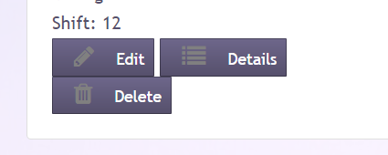*Standard button styles* | 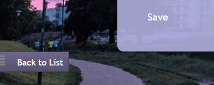*Save button with different style*|

The buttons are all a part of a View Model with an enum of Button Type. Save is included within this enum.

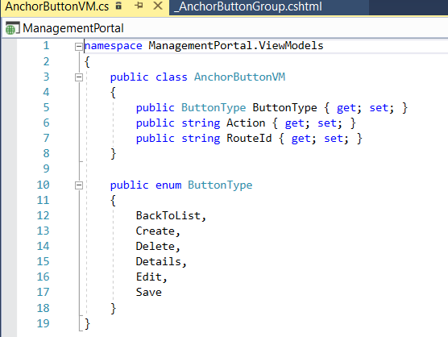

The styling for these buttons are all included in a Partial View, but there was no styling for ButtonType.Save, so I updated it to reflect the styling of the other buttons.
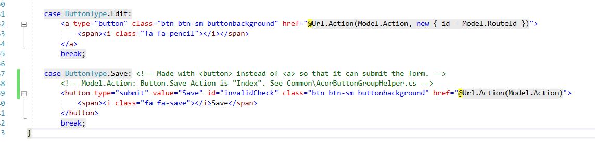

I also updated a helper controller which is used to easily add buttons to a page depending on the type of buttons needed.

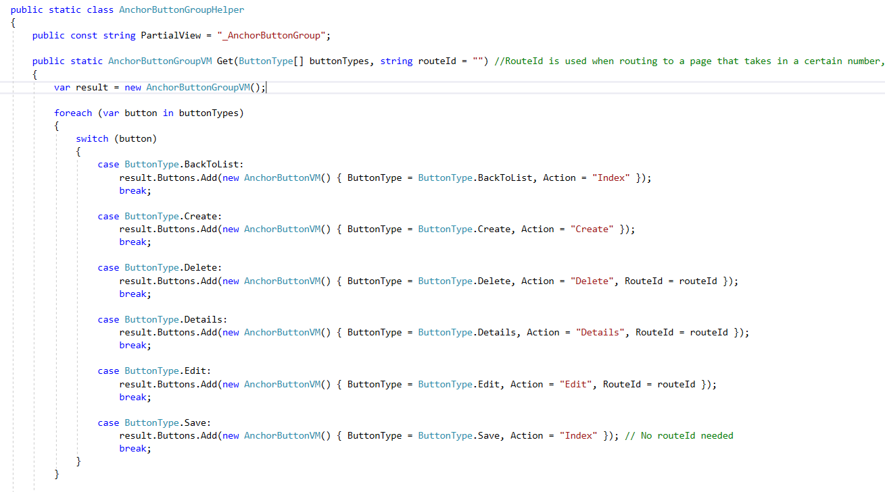

The final step was to update all the Edit views to use this same Partial View of the Button View Models. Now, if nayone needs to update the styles of the save buttons, they can do it in one place, and the styles will affect all the Save buttons throughout the web site.

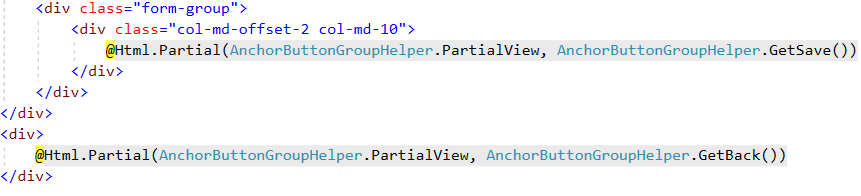

Here is the end result!

| Before  | After |
| --- | --- |
|*No styling* | 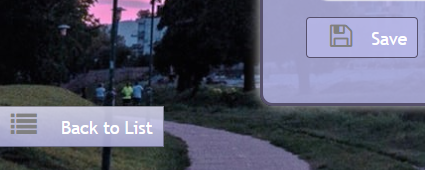*Updated Style*|

### User Story 2
#### Shift Time Editing
When the user creates a job, there is a button that opens a modal so they can add a default shift-start time, and also times for specific days, in case the default time isn't used for those specified days. However, if the user needs to edit a job, they can only edit the default time, and there is no modal to change other times. 

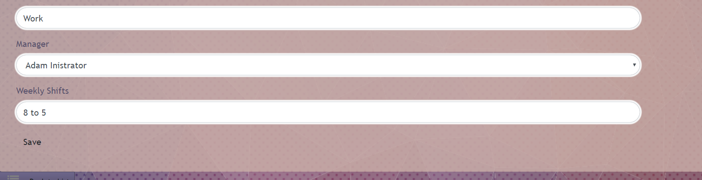
*Weekly Shifts input with single place to input default time only. No button to add Shift Times.*

My goal was to add a new modal, which would populate with all the times from the database, and when the user clicks add, it would immediately update the default time on the Edit page.

| New Button  | Modal |
| --- | --- |
|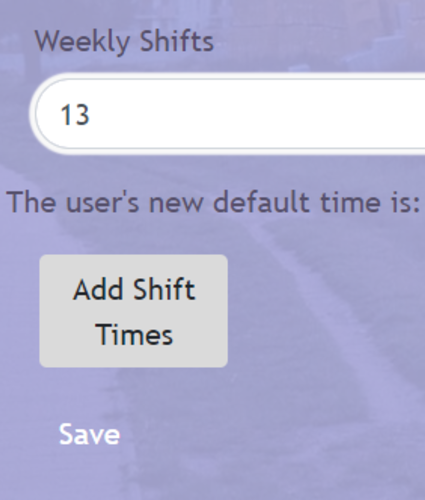 |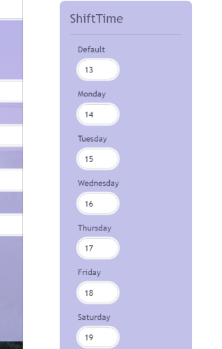|
|*Button added, plusa line of code for debugging.* | *The new modal!   (currently cumbersome, more on that later)*|

I added a new Partial View for the modal, using scaffolded code and borrowing code from the modal of the Create page. But I updated the code to use a Job model, instead of the ShiftTime modal, so that the modal could get info from the currently selected Job. This would allow the modal to auto-populate with current shift times.

| Model  | Updates |
| --- | --- |
|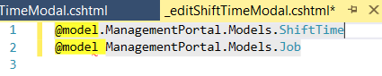*Old and new models* |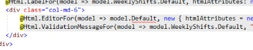*Old and new model reference*|

## End
