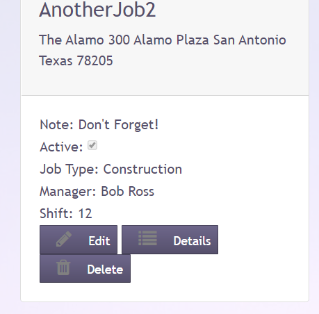
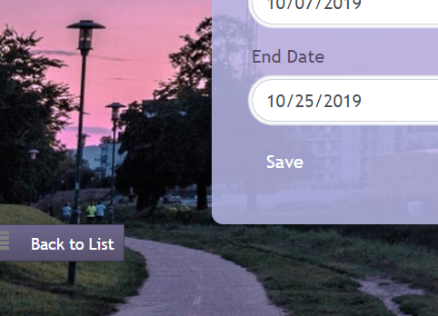
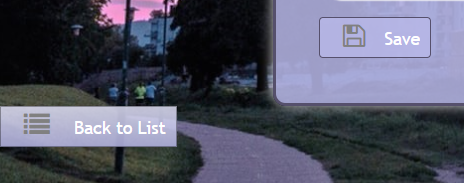

# Live Project Summary
## 2-week Live Project for The Tech Academy

During my time with the Tech Academy, I worked on a Live Project for two weeks along with other developers and a project manager. We worked in one-week sprints, with daily Stand-Up meetings, and a weekly Sprint Retrospective. This was a rewarding experience, and I worked on Back-End as well as Front-End User stories. 

### Overall Experience
I gained some valuable skills through this project that would be difficult to replace with study alone. These skills include:
- Using Version Control (Git) on a project with multiple users.
- Using project management software to maintain accountability. In this case, we used Azure DevOps.
- Working with a team who all have their own tasks.
- Learning to effectively communicate about my code.

## Back End

#### Save Button Partial View
The program I was working on had various CRUD buttons all with the same styling, except for the Save button. 

*Standard button styles*

*Save button with different style*

The buttons are all a part of a View Model with an enum of Button Type. Save is included within this enum.

The styling for these buttons are all included in a Partial View, but there was no styling for ButtonType.Save, so I updated it to reflect the styling of the other buttons.

I also updated a helper controller which is used to easily add buttons to a page depending on the type of buttons needed.

The final step was to update all the Edit views to use this same Partial View of the Button View Models. Now, if nayone needs to update the styles of the save buttons, they can do it in one place, and the styles will affect all the Save buttons throughout the web site.

Here is the end result!

 
