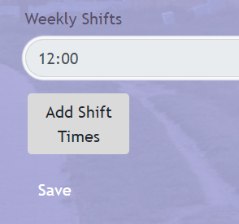

# Live Project Summary
## 2-week Live Project for The Tech Academy

During my time with the Tech Academy, I worked on a Live Project for two weeks along with other developers and a project manager. We worked in one-week sprints, with daily Stand-Up meetings, and a weekly Sprint Retrospective. This was a rewarding experience, and I worked on Back-End as well as Front-End User stories. Here is a detailed list of some of the work I did.

Table of Contents 
=================

* [Overall Experience](#overall-experience)
* [Back End](#back-end)
  * [User Story 1: Save Button Partial View](#user-story-1)
  * [User Story 2: Shift Time Editing](#user-story-2)
* [Front End](#front-end)
  * [User Story 3: Fix Shift Time Modal](#user-story-3)
  * [User Story 4: Update Schedule Index](#user-story-4)
  

  
* [End of Document](#end)

## Overall Experience
I gained some valuable skills through this project that would be difficult to replace with study alone. These skills include:
- Using Version Control (Git) on a project with multiple users.
- Using project management software to maintain accountability. In this case, we used Azure DevOps.
- Working with a team who all have their own tasks.
- Learning to effectively communicate about my code.

## Back End
[Back to top](#live-project-summary) | [To front end](#front-end)
### User Story 1
#### Save Button Partial View
The program I was working on had various CRUD buttons all with the same styling, except for the Save button. 

| Goal  | Problem |
| --- | --- |
|*Standard button styles* | *Save button with different style*|

The buttons are all a part of a View Model with an enum of Button Type. Save is included within this enum.

The styling for these buttons are all included in a Partial View, but there was no styling for ButtonType.Save, so I updated it to reflect the styling of the other buttons.

I also updated a helper controller which is used to easily add buttons to a page depending on the type of buttons needed.

The final step was to update all the Edit views to use this same Partial View of the Button View Models. Now, if nayone needs to update the styles of the save buttons, they can do it in one place, and the styles will affect all the Save buttons throughout the web site.

Here is the end result!

| Before  | After |
| --- | --- |
|*No styling* | *Updated Style*|

[Back to top](#live-project-summary) | [To back end](#back-end) | [To front end](#front-end)

### User Story 2

#### Shift Time Editing
When the user creates a job, there is a button that opens a modal so they can add a default shift-start time, and also times for specific days, in case the default time isn't used for those specified days. However, if the user needs to edit a job, they can only edit the default time, and there is no modal to change other times. 

*Weekly Shifts input with single place to input default time only. No button to add Shift Times.*

My goal was to add a new modal, which would populate with all the times from the database, and when the user clicks add, it would immediately update the default time on the Edit page.

| New Button  | Modal |
| --- | --- |
| ||
|*Button added, plusa line of code for debugging.* | *The new modal!   (currently cumbersome, more on that later)*|

I added a new Partial View for the modal, using scaffolded code and borrowing code from the modal of the Create page. But I updated the code to use a Job model, instead of the ShiftTime modal, so that the modal could get info from the currently selected Job. This would allow the modal to auto-populate with current shift times.

| Model  | Updates |
| --- | --- |
|*Old and new models* |*Old and new model reference*|

My next goal was to use jQuery to make an array of inputs, then I would be able to take the new default input and update the Weekly Shifts input with it. First, I had to make sure I was targeting the right parts of the array:

*I changed the background color with javascript to make sure I was targeting the right input, but I couldn't seem to get the value to change. It turns out, inputs don't have **innerHTML**, they have **values**. Lesson learned.*

Here's the jQuery that worked:

*I made use of the console as much as I could.*

Finally, I got the result I was looking for. I made the original  Weekly Shifts button "read-only" so the user would need to use the button to update it. The default time in the modal successfully updated the read-only section, and the database would be fully updated when the user clicks save.

| Original Time | New Input | Updated Time|
| --- | --- | --- |
||||

## Front End
  [Back to top](#live-project-summary) | [To back end](#back-end)
### User Story 3
#### Fix the Shift Time Modal

While working on that last story, I noticed the layout of the modals made them hard to deal with. They were too long for the screen and they could definitely be updated to provide a better user experience. Also, they would appear off to the right of the screen.

| Appears off-center | Very Long |
| --- | --- |
|||

With this challenge, DevTools was my best friend! Through a bit of trial and error, I added some bootstrap classes which made the modal much more responsive. 

*DevTools makes things go by so much faster.*

| Large Screen | Small Screen |
| --- | --- |
|  |  |

One final problem: There were other sections of the website which used some of Bootstraps modal classes, and some extra CSS was added to those classes, but they prevented this modal from aligning to the center. So I updated the site's CSS file and wrote the code in a way so that if another developer would later try to use the same Bootstrap class to center their modal, they could do so without any further issues.

[Back to top](#live-project-summary) | [To back end](#back-end) | [To front end](#front-end)

### User Story 4
#### Update the Schedule Index

Our current Schedule Index wasn't looking too sharp, so I was tasked with updating it.

| Before | Medium Size |
| --- | --- |
| | 

After using DevTools, I added some extra classes to the HTML, and started out with some inline CSS, just for the time being. Later, after I got it houw I wanted it, I moved the CSS over to the site CSS page. 

 *Some of the updating invlolved*

I was pleased with the final result!

|Medium Size| Small Size|
| --- | --- |
| |  |

| Before | After|
| --- | --- |
| |  |

[Back to top](#live-project-summary) | [To back end](#back-end) | [To front end](#front-end)

### Conclusion
These two weeks went by way too fast and they were a lot of fun. I admit that I was a bit overwhelmed when I first started. There were so many more files involved in a real project, and it took some time just familiarizing myself with it all. But I learned more and more every single day. Also, it was so rewarding being able to track all of my work and see how I was contributing. 
